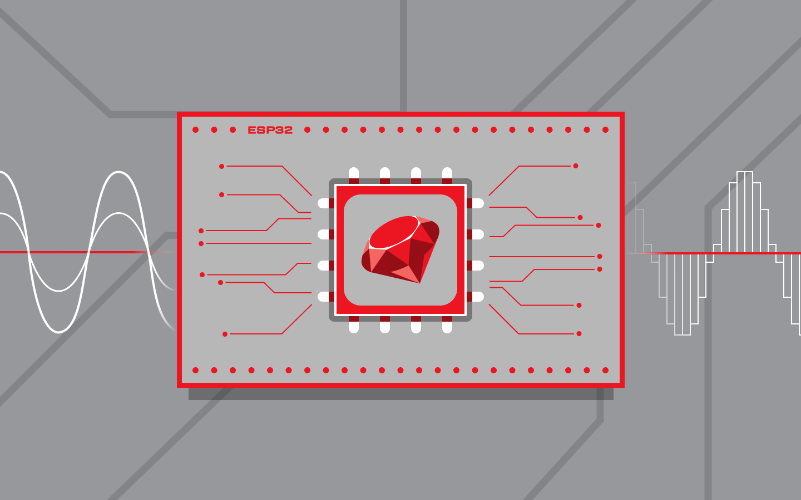
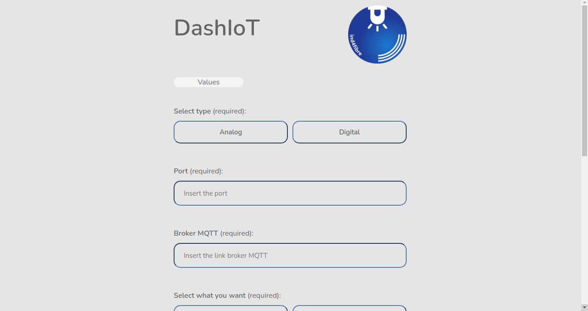
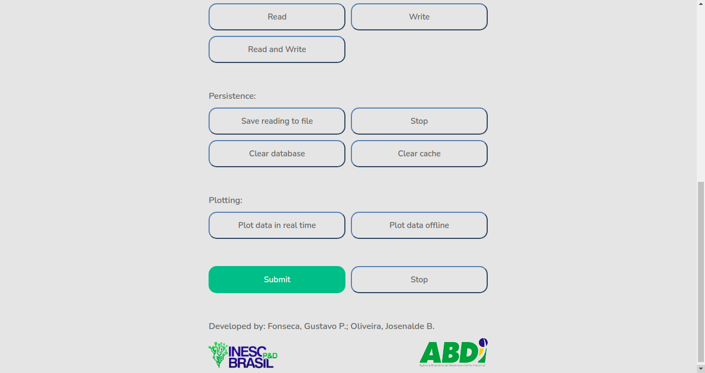
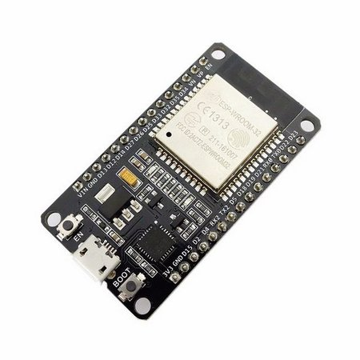
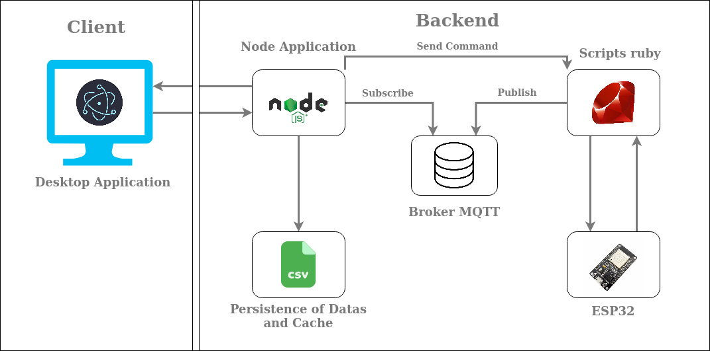

<h1 align="center" style="color:black;margin-top:30px;">DashIoT</h1>
<div align="center" style="font-size:40px;">
    <figure>
        
    </figure>
</div>

<p align="center">
    DashIoT is a dashboard created to send and receive data from analog and digital sensors, in <a
        href="https://en.wikipedia.org/wiki/Internet_of_things">IoT</a> context, through
    of esp32 board. This is an integrated research project of <a
        href="http://ind4fibre.inescbrasil.org.br/">IND4FIBRE</a> through of <a href="http://inescbrasil.org.br/">INESC
        P&D BRASIL</a>, developed at <a href="http://tapioca.eaj.ufrn.br/">TAPIOCA-LAB</a>
    of <a href="https://www.ufrn.br/">Federal University of Rio Grande do Norte</a>.
</p>

<hr />

<h2>Interface</h2>
<div align="center" style="padding:10px;">
    <table>
        <tr>
            <td>
                <figure>
                    
                    <figcaption align="center">Dashboard interface</figcaption>
                </figure>
            </td>
            <td>
                <figure>
                    
                    <figcaption align="center">Dashboard interface</figcaption>
                </figure>
            </td>
        </tr>
    </table>
</div>
<hr>

<h2>Usage examples</h2>

<div align="center">
    <table>
        <tr>
            <td>
                <figure>
                    
                    <figcaption align="center">
                        Analog reading
                    </figcaption>
                </figure>
            </td>
            <td>
                <figure>
                    
                    <figcaption align="center">
                        Digital reading
                    </figcaption>
                </figure>
            </td>
        </tr>
    </table>
</div>

<hr />
<h2> Instrumentation </h2>
<div align="center">
    <table>
        <tr style="padding:5;">
            <td>
                <figure>
                    <br />
                    <figcaption align="center">
                        ESP32
                    </figcaption>
                </figure>
            </td>
            <td>
                <figure>
                    <br />
                    <figcaption align="center">
                        Sensors
                    </figcaption>
                </figure>
            </td>
        </tr>
    </table>
</div>

<hr>

<h2>Software Tools</h2>

<ul>
    <li>Ruby</li>
    <li>Gem arduino_firmata</li>
    <li>Gem ruby-mqtt</li>
    <li>Eclipse Mosquitto</li>
    <li>Node.js</li>
    <li>Electron.js</li>
    <li>MQTT.js</li>
    <li>Chart.js</li>
    <li><a href="https://github.com/Gustavo053/Firmata-for-ESP32">Firmata for ESP32</a></li>
</ul>

<hr />

<h2>System Working Diagram</h2>

<div style="padding: 10px" align="center">
    <figure>
        
        <figcaption align="center">Application Execution Flow</figcaption>
    </figure>
</div>

<hr />

<h2>How to Use</h2>

<p>Clone this repository:</p>

```sh
$ git clone https://github.com/Gustavo053/DashIoT.git
```

<p>configure the environment:</p>

```sh
$ npm init
```

```sh
$ npm install
```

<p>Configure the package.json:</p>

```sh
{
"name": "estudo-electron",
"version": "1.0.0",
"description": "Dashboard para controlar o framework arduino_firmata",
"main": "index.js",
"scripts": {
"start": "electron ."
},
"author": "Gustavo",
"license": "MIT",
"devDependencies": {},
"dependencies": {
"chart.js": "^2.9.4",
"electron": "^10.1.5",
"mqtt": "^4.2.4"
}
}
```

<p>Run the project:</p>

```sh
$ npm start
```

<hr />

<h2>How to Contribute</h2>

- Fork this repository
- Create your branch with your feature: `git checkout -b my-feature`
- Commit your changes: `git commit -m 'feat: My new feature'`
- Push your branch: `git push origin my-feature`